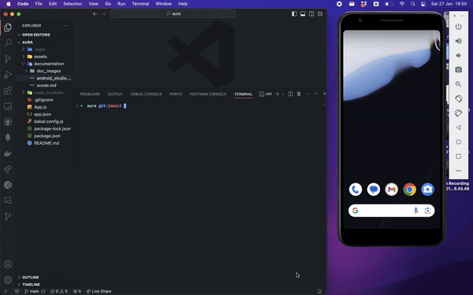

# Android Studio

Android Studio is the official IDE for Android development. It is based on IntelliJ IDEA and is available for Windows, macOS, and Linux.

## Installing Android Studio

Android Studio can be installed using Homebrew on macOS. 
```bash
brew install --cask android-studio
```

If you prefer, you can, apparently, download Android Studio from the [Android Studio website](https://developer.android.com/studio/). I have never done this.

Once opening Android Studio, I followed the default options to install the Android SDK and Android Virtual Device. I have not installed any other components. Everything seems to work fine with the default options but there was a little bit of awkaward configuration to get the Android Virtual Device to work (see below).

## Add path to ADB

I had to add a path to the Android Debug Bridge (adb) to my .zshrc file. I found the path by running `which adb` in the terminal. I then added the following line to my .zshrc file (because I use zsh, if you use bash, you will need to add it to your .bashrc file):
```bash
export ANDROID_HOME=/Users/pablojoyce/Library/Android/sdk
export PATH=$PATH:$ANDROID_HOME/emulator
export PATH=$PATH:$ANDROID_HOME/platform-tools
```
In the above, you would need to replace `/Users/pablojoyce/Library/Android/sdk` with the path to your Android SDK.

## Running the Android Virtual Device with Aura

Unlike, iOS, I found that the Android Virtual Device (AVD) did not automatically open when running `npx run android`. I had to open the AVD Manager from the Android Studio welcome screen and then click the green play button to start the AVD. Once it was running, I could run `npx run android` and it would open the app in the AVD.

The first time I ran this on a 2014 MacBook Air, it took a few minutes to open the AVD. I needed to press a few buttons when prompted but it worked smoothly albeit slowly. As with iOS, subsequent openings were much quicker. Bare in mind that a 2014 MacBook Air is not exactly an ideal machine for this kind of dev work.

Starting the AVD:


Starting Aura in the AVD for the second time on a 2014 MacBook Air:


## Running Aura on a physical Android device

I don't have an Android phone but if you do and run Aura on it, please add your experience here.