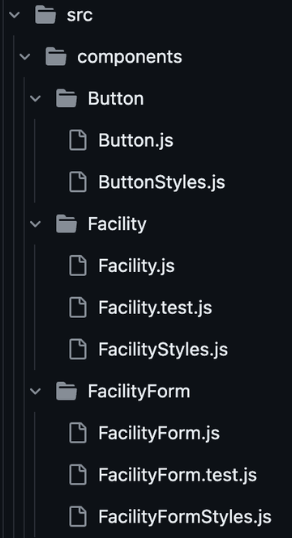
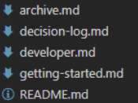

# Best practices

## Contents

- [Best practices](#best-practices)
  - [Contents](#contents)
- [File Structure](#file-structure)
  - [Stylesheet](#stylesheet)
- [Naming convention](#naming-convention)
  - [Component folders and files 📁 📄](#component-folders-and-files--)
  - [Non-component JavaScript files 📄](#non-component-javascript-files-)
  - [All other folders and files 📁 📄](#all-other-folders-and-files--)
  - [Git branches](#git-branches)
- [Commit Messages](#commit-messages)
- [Pull requests](#pull-requests)
  - [Before creating a Pull Request](#before-creating-a-pull-request)
  - [When making a Pull Request](#when-making-a-pull-request)
  - [Reviewing a Pull Request](#reviewing-a-pull-request)
  - [Create a Draft Pull Request](#create-a-draft-pull-request)
  - [Pull Request naming](#pull-request-naming)
- [Components](#components)
- [Testing 🧪](#testing-)
  - [Frontend](#frontend)
  - [Backend](#backend)
  - [E2E Tests](#e2e-tests)
- [Code consistency](#code-consistency)
- [VSCode Extensions](#vscode-extensions)

# File Structure

1. File structure - individual component folders
<p align="center">

</p>

## Stylesheet

The stylesheet should be located in-folder as default and a global file with colour variables.

# Naming convention

## Component folders and files 📁 📄

Component folders and their files should be named according to what they do/are, and using the PascalCase notation, e.g. `FacilityForm`.

## Non-component JavaScript files 📄

Non-component JavaScript files should be named according to what they do/are, and using the camelCase notation, e.g. `cafeController.js`.

## All other folders and files 📁 📄
Including all non-component directories and non-JavaScript files. This includes markdown and image files.

✅ Use kebab-case - lowercase and hyphens as delimiters.

❌ Don’t use spaces or underscores. Spaces are converted to %20 in URLs or can break an URL when shared. Underscores are difficult to see when the file name is displayed as an underlined link.

<!-- I removed the section below as it is covered in the above and I think it is worth having a proper overview of the overall file structure (coming soon) which will just further the repetition -->

<!-- ## Project tree folders 📁

These are the main folders in the repo, like `backend, frontend, src, public, routes, utils`, etc. Use kebab-case (words in use lowercase separated by dashes) as some file systems are case-insensitive (MacOS, Windows). -->

<!-- ## Markdown files

Use kebab-case (words in use lowercase separated by dashes), apart from the README file.

<p align="center">

</p> -->

## Git branches

Name branches in all lowercase, with the following three elements separated by a forward slash:
- Your initials (including collaborators).
- The task type, e.g. feat, fix, doc, design, test.
- The task separated by hyphens.

Examples:

```
👉 jn/test/api-cafe-route
👉 lsjn/doc/readme-best-practices
```

# Commit Messages

Write your commit message [in the imperative](https://gist.github.com/robertpainsi/b632364184e70900af4ab688decf6f53): "Fix bug" and not "Fixed
bug" or "Fixes bug." This convention matches up with commit messages
generated by commands like git merge and git revert.

```
👉 Add CPU arch filter scheduler support
👉 Fix bug that was duplicating icons
```

ℹ️ More examples [here](https://www.conventionalcommits.org/en/v1.0.0/)

# Pull requests

## Before creating a Pull Request
These procedures are in place to protect `main` and move possible merge conflicts to branch level.
- Pull the latest changes to `main` into your branch.
```bash
git switch main
git pull
git switch <your-branch>
git merge main
```
- Check any tests not covered by a CI pipeline are passing.
- Manual check that the app is working as expected.
- Check that all the acceptance criteria are met.

## When making a Pull Request

- Link to you ticket in the PR description. This cab be done using the shortcut `#` and then the ticket number.
- Give any pertinent information that is not covered in task ticket including any tests that should be run, decisions made that deviate from the original plan, etc.
- Advise of any acceptance criteria that have not been met and why, e.g. for merging current stable progress into `main` for group visibility.
- Optional: You may assign a reviewer, for instance, if already have prior knowledge of the task.

## Reviewing a Pull Request

All of the below should be done before approving a PR. They may be done in any order.

- Switch to the PR branch and run the app, frontend and backend. Check that the app is working as expected.
- Check that all the acceptance criteria are met.
- Check that the code is clean and follows the best practices.

## Create a Draft Pull Request

For group visibility, it is helpful to create a Draft Pull Request when you start committing to your branch and add the label “draft PR” to it.

## Pull Request naming
PR names should use the conventional commit tags (feat, fix, doc, design, test). Example:

```
👉 test(backend): user login auth
👉 feat(frontend): add user avatar
```

# Components

Components should be named in Pascal case according to what they do/are

File structure - Each component should have its own directory containing:
- The component file, e.g. `FacilityForm.js`
- A styleSheet file (if needed), e.g. `FacilityFormStyles.js`
- A test file (to be created only when testing starts), e.g. `FacilityForm.test.js`

StyleSheet location - As a separate file as default but it is more practical to keep the styleSheet in the component file for small components, e.g. MenuBar.js.

Always use `globalStyleVariables.js` for colours where possible (in the `styles` directory).

# Testing 🧪

## Frontend

We use Jest and React Testing Library for unit and integration tests.

## Backend

We use Vitest for unit and integration tests and Postman test for API endpoints.

## E2E Tests

We use Puppeteer for end-to-end tests.

# Code consistency

- We use arrow functions for all functions, including React components, unless older style functions are specifically required, e.g. for hoisting.
- We use `async` and `await` for asynchronous functions rather than promises.
- We use `" "` double quotation marks instead of `' '` single quotation marks.
- Function names (except React component function declarations) should be verbs, descriptive and follow camelCase. Favour readability over brevity.
- Endpoint names should be descriptive and follow kebab-case.

# VSCode Extensions

See the [Pensano recommended extensions](https://drive.google.com/file/d/1KNMCXaLJ6C_HvExO8RDWrYloQrE1EaTz/view?usp=sharing) PDF file.
